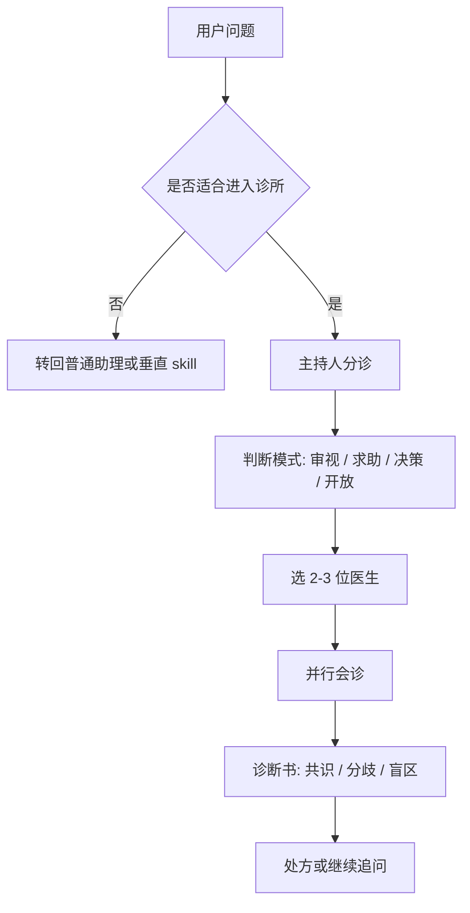
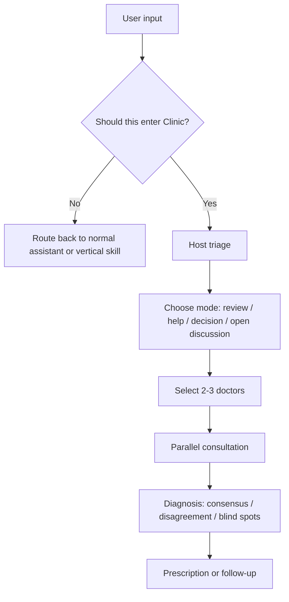

# Clinic Skill

**A reusable consultation framework for multi-perspective reasoning, not a prompt pile.**

[中文](#中文) | [English](#english)

---

## 中文

### 这是什么

`clinic` 是一个可复用的诊所式 skill 框架。

它不是把几个人设拼在一起轮流说话，也不是一个装饰性的 multi-agent demo。  
它的核心结构是：

- 一个不扮演医生的主持人
- 一组具有明确框架差异的医生
- 一个强调暴露前提、保留分歧、避免讨好的会诊流程
- 一套持续迭代的评测体系

你可以把它理解成：

> 不是替用户快速给答案，  
> 而是把问题拆开，把前提暴露出来，把有价值的分歧留下来。

### 设计哲学

这个项目背后的判断很简单：

- 好的咨询，不是最快给结论
- 好的多角色，不是热闹，而是有张力
- 好的总结，不是把所有分歧揉平
- 好的 skill，不是“看起来聪明”，而是能被评测、能被迭代

所以 `clinic` 的重点不是“模仿人格”，而是构造一种更像真实会诊的推理秩序：

- 主持人负责分诊、选人、组织冲突、写诊断书
- 医生负责从各自框架出发给出不同解释
- 如果意见不一致，系统优先保留分歧，而不是伪造共识
- 如果问题还没想清，系统优先帮助用户看见问题，而不是抢着给建议

### How It Works



### 它和普通方案有什么不同

**不是普通 assistant**

- 普通 assistant 倾向于尽快收束答案
- `clinic` 更在意先把问题拆对

**不是普通 persona prompt**

- 普通 persona prompt 常常只有风格差异
- `clinic` 追求的是框架差异、尺度差异、判断张力

**不是普通 multi-agent**

- 很多 multi-agent 系统只是让多个 agent 平铺直叙
- `clinic` 把主持人层单独拿出来，专门处理分诊、冲突组织和总结失真问题

### 评测不是附属品

这个项目从一开始就不是只写 skill 文件。

仓库里已经把评测拆成了几层：

- `trigger`
  - 该不该进入诊所
- `routing`
  - 该分到哪种模式
- `doctor_selection`
  - 选医生有没有张力和覆盖
- `end_to_end`
  - 整场会诊是否保留分歧且有用
- `multi_turn`
  - 多轮追问后会不会漂、会不会压扁上下文

它还显式参考了外部基准的思路：

- `AgencyBench`
- `PersonaEval`
- `PersonaChat`

目标不是“证明这个 skill 很厉害”，而是确保它可以被持续批评、持续改进。

### 仓库结构

```text
clinic/
  SKILL.md                  # 主持人规则与会诊流程

doctors/
  <doctor>/SKILL.md         # 医生侧的 persona skill

evals/
  clinic/*.jsonl            # 单轮与多轮评测样本
  rubric.md                 # 评分规则
  results/*.md              # 设计级 baseline 结果

docs/
  eval-design.md            # 评测设计说明
```

### 适合什么，不适合什么

适合：

- 观点审视
- 多视角讨论
- 人生、关系、职业、决策类求助
- 用户明确希望“让几位不同框架的人来看看”

不适合：

- 事实查询
- 纯执行任务
- 低价值日常选择
- 已有明确专业工作流的垂直问题

### 当前状态

这不是一个“已经完成”的项目。

它更像一个持续打磨中的框架，重点不在规模，而在质量控制：

- 已有医生库
- 已有单轮评测
- 已有多轮评测
- 已经完成多轮基线分析
- 仍在继续收紧主持人规则

如果你关心的不只是“怎么写一个 skill”，而是“怎么把一个 skill 做成可以迭代的系统”，这个仓库就是给这种问题准备的。

---

## English

### What This Is

`clinic` is a reusable consultation-style skill framework.

It is not a pile of personas taking turns to speak, and it is not a decorative multi-agent demo.

Its core structure is:

- a host that is explicitly **not** a doctor
- a roster of doctors with genuinely different reasoning frameworks
- a consultation flow that prioritizes exposing assumptions, preserving disagreement, and avoiding flattery
- an evaluation stack designed for iteration

In short:

> not a system that rushes to answers,  
> but one that clarifies the problem before pretending to solve it.

### Design Philosophy

This project is built on a few strong opinions:

- good consultation is not the fastest conclusion
- good multi-role design is not noise, but tension
- good synthesis does not flatten disagreement
- good skills should be evaluated, not admired from a distance

So the point of `clinic` is not just persona simulation.

It tries to build a more disciplined reasoning order:

- the host triages, selects doctors, organizes conflict, and writes the diagnosis
- the doctors contribute from different frameworks
- when disagreement is real, the system preserves it instead of fabricating consensus
- when the problem is still vague, the system prefers clarification over premature advice

### How It Works



### Why It Feels Different

**Not a normal assistant**

- a normal assistant tends to converge quickly
- `clinic` tries to structure the problem correctly first

**Not a normal persona prompt**

- most persona prompts only change style
- `clinic` aims for framework difference, scale difference, and meaningful tension

**Not a normal multi-agent setup**

- many multi-agent systems simply stack outputs side by side
- `clinic` separates out the host layer to manage triage, conflict, and synthesis distortion

### Evaluation Is Part of the Product

This repository was not built as "just a skill file".

The evaluation stack is split into layers:

- `trigger`
  - should the system enter Clinic at all
- `routing`
  - which mode should be used
- `doctor_selection`
  - whether the roster has enough coverage and tension
- `end_to_end`
  - whether the consultation is actually useful without flattening disagreement
- `multi_turn`
  - whether follow-up rounds drift, reset, or compress context poorly

It also borrows ideas from external benchmarks:

- `AgencyBench`
- `PersonaEval`
- `PersonaChat`

The goal is not to prove the skill is impressive.

The goal is to make it criticizable, measurable, and improvable.

### Repository Map

```text
clinic/
  SKILL.md                  # host rules and orchestration logic

doctors/
  <doctor>/SKILL.md         # doctor-side persona skills

evals/
  clinic/*.jsonl            # single-turn and multi-turn eval cases
  rubric.md                 # scoring rules
  results/*.md              # design-level baseline results

docs/
  eval-design.md            # evaluation design notes
```

### Good Fit / Bad Fit

Good fit:

- viewpoint review
- multi-perspective discussion
- life, relationship, work, and decision support
- cases where the user explicitly wants several frameworks in dialogue

Bad fit:

- factual lookup
- pure execution tasks
- low-value daily choices
- vertical expert workflows that already have a better tool

### Status

This is not a "finished" repository.

It is a framework under disciplined iteration:

- doctor library in place
- single-turn evaluation in place
- multi-turn evaluation in place
- baseline analyses written
- host rules still being tightened

If you care not only about how to write a skill, but how to turn one into an iterated system, this repository is for that problem.
