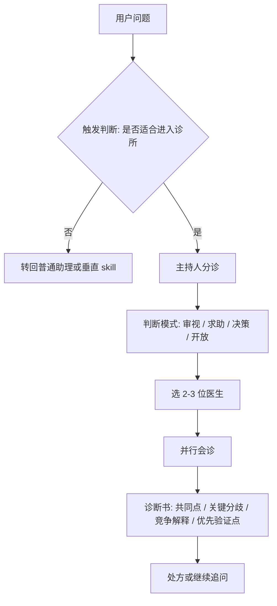
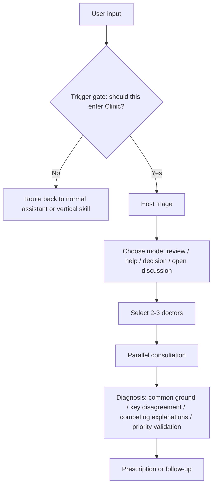

# Clinic Skill

**A reusable consultation framework for multi-perspective reasoning, not a prompt pile.**

[中文](#中文) | [English](#english)

---

## 中文

### 这是什么

`clinic` 是一个可复用的诊所式 skill 框架。

它不是把几个人设拼在一起轮流说话，也不是那种看着热闹、其实没什么秩序的 multi-agent demo。  
它真正的骨架是：

- 一个不扮演医生的主持人
- 一组具有明确框架差异的医生
- 一个强调暴露前提、保留分歧、避免讨好的会诊流程
- 一套持续迭代的评测体系

如果要用一句话概括：

> 不是替用户快速给答案，  
> 而是把问题拆开，把前提暴露出来，把有价值的分歧留下来。

### 为什么会做这个

这个项目不是从“我想做个 AI 角色扮演”开始的。

更早的起点其实很简单：我是个想法很多的人。  
同一件事，我脑子里经常会同时跑出几种互相不一样的判断。但这些判断，大多数时候没有地方真的展开说。不是因为没人能听懂，而是因为现实里很少有人既愿意听，又能给出足够有说服力的回应。

时间久了，这些想法就只能在脑子里自己打转。

后来我开始想，能不能做一个东西，让那些我真正敬佩的人来评价我的观点？

这个项目最早一版的名字其实叫 **“擂台”**。  
当时的直觉是：既然想法需要被检验，那就把它们放上擂台。

但很快我发现，生活里不是所有问题都适合拿来“打”。  
有些时候你不是想被击败，也不是想赢，而是根本不知道该怎么办，只想先有人帮你看看问题到底出在哪。

所以它后来变成了 **“诊所”**。

这个名字更接近我真正想做的事：

- 不是只挑战你的想法
- 还要在你没想清楚的时候，帮你分诊、拆解、给一点方向

### 医生从哪里来

`clinic` 里的医生，并不是临时写出来的 AI 角色。

这里的医生侧 skill，主要建立在 [nuwa-skill](https://github.com/alchaincyf/nuwa-skill) 这套蒸馏方法之上。  
`nuwa-skill` 不是在做“模仿名人说话”，而是在尽量从公开材料里提炼一个人的：

- 心智模型
- 决策启发式
- 表达 DNA
- 价值边界与反模式
- 诚实边界

所以，`clinic` 里的医生不是靠口头禅撑风格，而是尽量基于可追溯的认知框架来分析问题。

这件事很关键。因为如果底层医生只是会“像某个人说话”，那多医生会诊最后还是会滑回更花哨的角色扮演。

### 设计哲学

这个项目背后的判断其实不复杂：

- 好的咨询，不是最快给结论
- 好的多角色，不是热闹，而是有张力
- 好的总结，不是把所有分歧揉平
- 好的 skill，不是“看起来聪明”，而是能被评测、能被迭代

所以 `clinic` 的重点从来不是“模仿人格”，而是尽量搭出一种更像真实会诊的推理秩序：

- 主持人负责分诊、选人、组织冲突、写诊断书
- 医生负责从各自框架出发给出不同解释
- 如果意见不一致，系统优先保留分歧，而不是伪造共识
- 如果问题还没想清，系统优先帮助用户看见问题，而不是抢着给建议

### 它不是简单的 AI 扮演

`clinic` 不是“让几个 AI 假装成名人，然后轮流说几段话”。

它和普通角色扮演的差别，至少有四层：

**1. 底层不是风格模仿，而是认知蒸馏**

- 医生侧 skill 主要来自 `nuwa-skill`
- 重点不是学语气，而是学判断框架、启发式和边界

**2. 医生不是主角，主持人才是系统核心**

- 单独的 persona skill 解决的是“一个人会怎么看”
- `clinic` 新增的是主持人层：分诊、选人、组织分歧、写诊断书、开处方

**3. 目标不是制造热闹，而是提高问题分辨率**

- 角色扮演常常追求“像不像”
- `clinic` 更关心：有没有拆对前提、有没有把不同解释路径分开、有没有避免过早下结论

**4. 结果不是对话截图，而是可评测的系统**

- 仓库里不只放了 skill
- 还放了 trigger、routing、doctor selection、end-to-end、multi-turn 的评测样本和 baseline

所以更准确的说法是：

> `nuwa-skill` 负责把“医生”蒸出来，  
> `clinic` 负责让这些医生在一个严肃的会诊秩序里工作。

### How It Works

第一步不是直接开始会诊，而是先判断：**这个问题到底适不适合进入诊所**。  
如果不适合，就应该回到普通 assistant 或更垂直的 skill，而不是硬拉进来。



### 一个短对比：普通 assistant 会解释，`clinic` 会拆开

用户问题：

> 我是不是把勤奋当成了思考的替代品？

一个普通 assistant 往往会给出一段顺滑、完整、也不算错的分析，比如：

- 你可能一直在做“不暴露判断质量”的事
- 你很忙，但关键问题推进很慢
- 你在用输出数量安慰自己，而不是追问方向是否正确
- 真正的问题可能不是不努力，而是没有面对真正需要判断的地方

这种回答的问题不在于它错。  
问题在于，它基本只给出了一条解释路径，而且很快就开始收束。

`clinic` 会先把这个问题拆开，而不是马上替你下结论。

例如，一次合理的会诊阵容可能是：

- **费曼**
  - 先看你到底有没有想清楚问题，还是只是把“做了很多事”误当成了理解
- **芒格**
  - 先看你是不是在用忙碌回避判断，尤其是在回避那个真正有风险的决定
- **王阳明**
  - 先看你所谓的“行”，到底是不是建立在真知之上，还是只是动作很多

主持人不会急着说“对，你就是在假装勤奋”。  
更好的诊断方式通常是把它拆成至少三种可能：

- 你不是不勤奋，而是没有真正定义问题
- 你不是没思考，而是在回避那个会暴露判断对错的决策点
- 你不是知行合一，而是在用持续行动掩盖并未形成判断这件事

差别就在这里：

- 普通 assistant 比较擅长把这个问题**解释清楚**
- `clinic` 更想把这个问题**拆出几种不同的成立方式**

前者更顺。  
后者更容易逼近真实问题。

下面是一段按当前 `clinic` 规则整理过的实际回复风格：

```text
🏥 本次会诊：
- 费曼：看你到底是真的想清楚了，还是只是把“做了很多”误当成理解
- 芒格：看你是不是在用忙碌回避真正会暴露判断质量的决定
- 王阳明：看你的“行”是不是建立在真知上，还是只是动作很多

💬 费曼：
你得先小心一个错觉：会做很多事，不等于真的理解问题。很多人一忙起来，就不再追问“我到底在解决什么”。

💬 芒格：
你要问的不是“我够不够努力”，而是“我现在做的这些事，有没有减少关键不确定性？”

💬 王阳明：
若你只是终日动作不停，心里却并不知道此事为何而做、轻重先后如何分别，那这不叫知行合一，这叫以事掩心。

📋 诊断书：
共识不是“你懒”，而是你可能在用勤奋保护自己，避免过早面对那个真正需要判断的问题。

三位医生也没有在说同一句话：
- 费曼在怀疑你其实没想清楚问题
- 芒格在怀疑你其实在回避判断
- 王阳明在怀疑你在用行动掩盖内心未定
```

### 更多实例和证据

一个例子不够。这个项目要站得住，必须能被具体案例反复检验。

我把更完整的示例放在 [docs/examples.md](docs/examples.md)，目前包括：

- 勤奋是不是替代了思考
- “边界感”是不是被滥用了
- 大厂 offer 还是创业公司 offer

每个例子都按同一套结构展开：

- 原始用户问题
- 普通 assistant 的典型回答倾向
- `clinic` 应该如何分诊和选医生
- 它到底多保留了什么分歧、竞争解释或验证点

更硬的评测证据在 `evals/` 里：

- [evals/clinic/host_failure_cases.jsonl](evals/clinic/host_failure_cases.jsonl)
- [evals/clinic/multi_turn.jsonl](evals/clinic/multi_turn.jsonl)
- [evals/rubric.md](evals/rubric.md)
- [evals/live/README.md](evals/live/README.md)

### 它和普通方案有什么不同

**不是普通 assistant**

- 普通 assistant 倾向于尽快收束答案
- `clinic` 更在意先把问题拆对

**不是普通 persona prompt**

- 普通 persona prompt 常常只有风格差异
- `clinic` 追求的是框架差异、判断差异、以及不同解释路径之间是否被清楚分开

**不是普通 multi-agent**

- 很多 multi-agent 系统只是让多个 agent 平铺直叙
- `clinic` 把主持人层单独拿出来，专门处理分诊、冲突组织和总结失真问题

**不是单独使用 `nuwa-skill`**

- `nuwa-skill` 的强项是把一个人物蒸馏成可调用的 perspective skill
- `clinic` 的新增价值是把这些 perspective skill 编排成一个完整工作流
- 这个工作流主要解决几件事：
  - 什么时候该进诊所
  - 该由谁来回答
  - 分歧怎么保留
  - 多轮追问后怎么不跑偏
  - 怎样通过评测持续收紧规则

### 评测不是附属品

这个项目从一开始就不是只想写一份 skill 文件。

仓库里已经把评测拆成了几层：

- `trigger`
  - 该不该进入诊所
- `routing`
  - 该分到哪种模式
- `doctor_selection`
  - 选医生有没有张力和覆盖
- `end_to_end`
  - 整场会诊是否保留分歧且有用
- `multi_turn`
  - 多轮追问后会不会漂、会不会压扁上下文

它还显式参考了外部基准的思路：

- `AgencyBench`
- `PersonaEval`
- `PersonaChat`

目标不是“证明这个 skill 很厉害”，而是让它能被持续批评，也能被持续改进。

### 仓库结构

```text
clinic/
  SKILL.md                  # 主持人规则与会诊流程

doctors/
  <doctor>/SKILL.md         # 医生侧的 persona skill

evals/
  clinic/*.jsonl            # 单轮与多轮评测样本
  rubric.md                 # 评分规则
  results/*.md              # 设计级 baseline 结果

docs/
  eval-design.md            # 评测设计说明
```

### 适合什么，不适合什么

适合：

- 观点审视
- 多视角讨论
- 人生、关系、职业、决策类求助
- 用户明确希望“让几位不同框架的人来看看”

不适合：

- 事实查询
- 纯执行任务
- 低价值日常选择
- 已有明确专业工作流的垂直问题

### 当前状态

这不是一个“已经完成”的项目。

它更像一个还在持续打磨的框架。重点不在规模，而在质量控制：

- 已有医生库
- 已有单轮评测
- 已有多轮评测
- 已经完成多轮基线分析
- 仍在继续收紧主持人规则

如果你关心的不只是“怎么写一个 skill”，而是“怎么把一个 skill 做成一个能迭代的系统”，这个仓库就是为这种问题准备的。

### 鸣谢

这个项目应该明确感谢 [nuwa-skill](https://github.com/alchaincyf/nuwa-skill)。

`clinic` 里很多医生侧 skill 的基础思路，直接受益于 `nuwa-skill` 对“蒸馏一个人的思维方式”这件事的系统化方法。  
没有这条思路，`clinic` 很容易退化成人设拼贴，或者退化成名人语气模仿。

更准确地说：

- `nuwa-skill` 提供了医生侧的蒸馏方法论
- `clinic` 在这个基础上继续做了主持人层、分诊规则、会诊流程、分歧保留和评测闭环

所以这不是“顺手借了几个角色来用”，而是很明确地站在前人的方法上继续往前做。

---

## English

### What This Is

`clinic` is a reusable consultation-style skill framework.

It is not a pile of personas speaking in sequence, and it is not a decorative multi-agent demo.

The real structure is:

- a host that is explicitly **not** a doctor
- a roster of doctors with genuinely different reasoning frameworks
- a consultation flow that prioritizes exposing assumptions, preserving disagreement, and avoiding flattery
- an evaluation stack designed for iteration

If you want the shortest version:

> not a system that rushes to answers,  
> but one that clarifies the problem before pretending to solve it.

### Why I Built This

This project did not start from "I want to build an AI roleplay system."

The real starting point was simpler than that: I am the kind of person who often has several competing ways of thinking about the same thing.  
In practice, those lines of thought usually have nowhere to go. Not because nobody can understand them, but because very few people are both interested enough to stay with them and sharp enough to respond in a way that actually moves the problem forward.

So the thoughts just keep circling in my head.

At some point, a more specific idea appeared: what if I could build a project where the people I genuinely respect could "look at" my ideas with me?

The first version of this project was actually called **"Arena"**.  
At the time that felt natural: if ideas need to be tested, put them in the ring.

But pretty quickly I realized that not every problem in life wants a fight.  
Sometimes you do not want to win or lose an argument. Sometimes you are simply stuck and want someone to help you see what the problem even is.

That is why it became **"Clinic."**

That name is much closer to what I actually wanted:

- not only to challenge ideas
- but also to examine them, diagnose them, and sometimes offer direction

### Where The Doctors Come From

The doctors in `clinic` are not improvised AI characters.

Most doctor-side skills in this repository are built on top of [nuwa-skill](https://github.com/alchaincyf/nuwa-skill), a framework for distilling how a person thinks from public material.

What `nuwa-skill` extracts is not just style. It tries to distill:

- mental models
- decision heuristics
- expression DNA
- value boundaries and anti-patterns
- honest limitations

That distinction matters.

If the underlying doctors only "sound like" famous people, then a multi-doctor consultation is still just theatrical roleplay.  
`clinic` depends on the stronger claim: the doctors should differ in reasoning structure, not only in tone.

### Design Philosophy

This project is built on a few fairly direct beliefs:

- good consultation is not the fastest conclusion
- good multi-role design is not noise, but tension
- good synthesis does not flatten disagreement
- good skills should be evaluated, not admired from a distance

So the point of `clinic` is not persona simulation by itself.

It tries to build a more disciplined reasoning order:

- the host triages, selects doctors, organizes conflict, and writes the diagnosis
- the doctors contribute from different frameworks
- when disagreement is real, the system preserves it instead of fabricating consensus
- when the problem is still vague, the system prefers clarification over premature advice

### This Is Not Simple AI Roleplay

`clinic` is not "ask several AIs to pretend to be famous thinkers and let them speak in turns."

Its difference from ordinary roleplay shows up at four levels:

**1. The base layer is distilled cognition, not style mimicry**

- the doctor skills mostly come from `nuwa-skill`
- the point is not catchphrases, but recurring reasoning patterns, heuristics, and boundaries

**2. The doctors are not the full system; the host is**

- a single persona skill answers "how would this person see the problem?"
- `clinic` adds the orchestration layer: triage, doctor selection, disagreement management, diagnosis, and prescription

**3. The objective is problem resolution quality, not theatrical realism**

- roleplay systems often optimize for whether the voice feels convincing
- `clinic` cares more about whether assumptions were exposed, interpretations were separated, and premature closure was avoided

**4. The output is tied to evaluation**

- this repository does not stop at skill files
- it includes trigger, routing, doctor-selection, end-to-end, and multi-turn evaluation assets

The cleaner framing is:

> `nuwa-skill` distills the doctors.  
> `clinic` puts those doctors inside a disciplined consultation system.

### How It Works

The first step is not consultation.  
It is a gate: **should this input enter Clinic at all?**

If the answer is no, it should route back to a normal assistant or a more appropriate vertical skill.



### A Short Contrast: a normal assistant explains, `clinic` separates

User prompt:

> Am I using diligence as a substitute for thinking?

A normal assistant will often produce a smooth, reasonable explanation such as:

- you may be doing work that never exposes the quality of your judgment
- you stay busy, but the core problem moves slowly
- output volume is being used as reassurance
- the real issue may not be effort, but avoidance of the actual decision point

That answer is not necessarily wrong.

The problem is that it usually gives you one clean interpretive path, then starts converging too early.

`clinic` tries to separate the problem before resolving it.

A plausible consultation roster here might be:

- **Feynman**
  - are you actually thinking, or just mistaking activity for understanding?
- **Munger**
  - are you using busyness to avoid the judgment that carries real downside?
- **Wang Yangming**
  - is your "action" grounded in real understanding, or is it just motion?

The host should not rush to say: "yes, you are faking diligence."

A better diagnosis is to separate at least three live possibilities:

- you are not under-working; you may be avoiding the real problem definition
- you are not failing to think; you may be avoiding the decision that would expose whether your judgment is right
- you are not achieving unity of thought and action; you may be using continuous action to cover for the absence of judgment

That is the difference:

- a normal assistant is good at **explaining the problem**
- `clinic` is trying to **separate the problem into distinct possibilities**

The first is smoother.  
The second is often more useful.

Here is a compact example of the actual `clinic` reply style:

```text
🏥 Consultation roster:
- Feynman: are you mistaking activity for understanding?
- Munger: are you using busyness to avoid a judgment with real downside?
- Wang Yangming: is your action grounded in real understanding, or just motion?

💬 Feynman:
Doing a lot is not the same as understanding the problem.

💬 Munger:
The real question is not whether you are working hard, but whether your work is reducing key uncertainty.

💬 Wang Yangming:
If your actions are many but your judgment is still unsettled, then action is being used to hide what is still unclear.

📋 Diagnosis:
The consensus is not "you are lazy." The consensus is that diligence may be protecting you from facing the actual judgment point.

And the three doctors are not saying the same thing:
- Feynman suspects you have not defined the problem clearly
- Munger suspects you are avoiding judgment
- Wang Yangming suspects you are using action to cover inner uncertainty
```

### More Examples And Evidence

One example is not enough. If this project is serious, it should survive repeated concrete cases.

More examples are collected in [docs/examples.md](docs/examples.md), including:

- diligence as a substitute for thinking
- whether "boundaries" are being overused
- choosing between a big-company offer and a startup offer

Each example shows:

- the original user input
- the typical normal-assistant tendency
- the expected `clinic` triage and doctor selection
- what disagreement, competing explanation, or validation point `clinic` preserves

The harder evaluation assets are under `evals/`:

- [evals/clinic/host_failure_cases.jsonl](evals/clinic/host_failure_cases.jsonl)
- [evals/clinic/multi_turn.jsonl](evals/clinic/multi_turn.jsonl)
- [evals/rubric.md](evals/rubric.md)
- [evals/live/README.md](evals/live/README.md)

### Why It Feels Different

**Not a normal assistant**

- a normal assistant tends to converge quickly
- `clinic` tries to structure the problem correctly first

**Not a normal persona prompt**

- most persona prompts only change style
- `clinic` aims for framework difference, judgment difference, and clearly separated interpretive paths

**Not a normal multi-agent setup**

- many multi-agent systems simply stack outputs side by side
- `clinic` separates out the host layer to manage triage, conflict, and synthesis distortion

**Not just `nuwa-skill` used directly**

- `nuwa-skill` is strong at turning a person into a perspective skill
- `clinic` adds the missing system layer:
  - when to enter consultation
  - who should answer
  - how disagreement is preserved
  - how follow-up rounds avoid drift
  - how the whole workflow is evaluated and improved

### Evaluation Is Part of the Product

This repository was not built as "just a skill file".

The evaluation stack is split into layers:

- `trigger`
  - should the system enter Clinic at all
- `routing`
  - which mode should be used
- `doctor_selection`
  - whether the roster has enough coverage and tension
- `end_to_end`
  - whether the consultation is actually useful without flattening disagreement
- `multi_turn`
  - whether follow-up rounds drift, reset, or compress context poorly

It also borrows ideas from external benchmarks:

- `AgencyBench`
- `PersonaEval`
- `PersonaChat`

The goal is not to prove the skill is impressive.

The goal is to make it criticizable, measurable, and improvable.

### Repository Map

```text
clinic/
  SKILL.md                  # host rules and orchestration logic

doctors/
  <doctor>/SKILL.md         # doctor-side persona skills

evals/
  clinic/*.jsonl            # single-turn and multi-turn eval cases
  rubric.md                 # scoring rules
  results/*.md              # design-level baseline results

docs/
  eval-design.md            # evaluation design notes
```

### Good Fit / Bad Fit

Good fit:

- viewpoint review
- multi-perspective discussion
- life, relationship, work, and decision support
- cases where the user explicitly wants several frameworks in dialogue

Bad fit:

- factual lookup
- pure execution tasks
- low-value daily choices
- vertical expert workflows that already have a better tool

### Status

This is not a "finished" repository.

It is a framework under disciplined iteration:

- doctor library in place
- single-turn evaluation in place
- multi-turn evaluation in place
- baseline analyses written
- host rules still being tightened

If you care not only about how to write a skill, but how to turn one into an iterated system, this repository is for that problem.

### Acknowledgment

This project should explicitly acknowledge [nuwa-skill](https://github.com/alchaincyf/nuwa-skill).

Much of the foundation for the doctor-side skills in `clinic` benefits directly from `nuwa-skill`'s method for distilling how a person thinks.  
Without that foundation, `clinic` would be much more likely to collapse into ordinary persona stacking or voice imitation.

A more accurate description is:

- `nuwa-skill` provides the doctor-distillation methodology
- `clinic` builds the orchestration layer on top of it: triage, consultation structure, disagreement preservation, and evaluation

So this repository is not merely "using a few characters."  
It is taking a prior method seriously and extending it into a consultation system.
